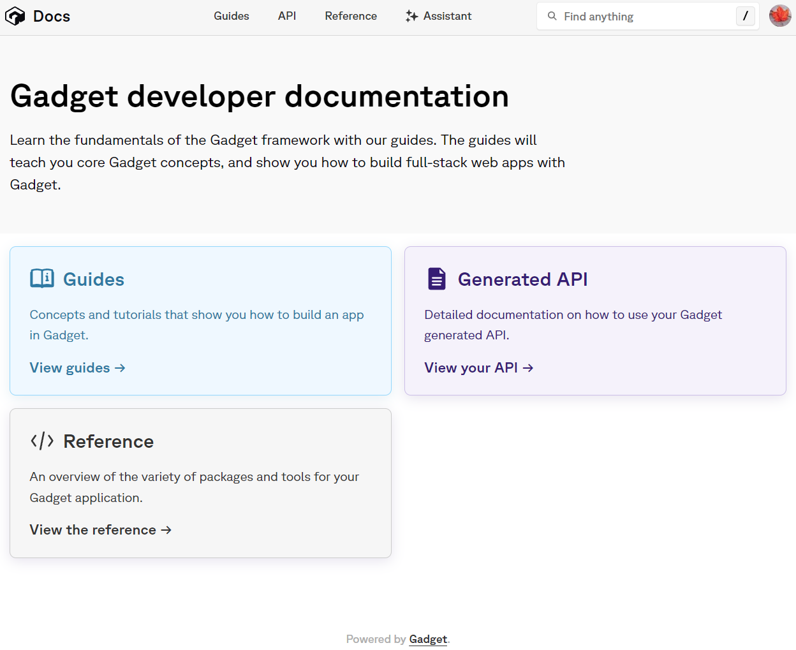
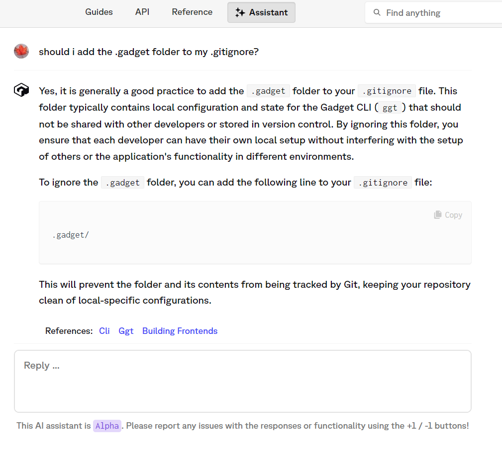

# Trying out [Gadget](gadget.dev)

I tried making a simple chat app using Gadget to see how the experience is versus what you would need to do to create an app with similar features from scratch.

## What Gadget comes with out of the box

- Google authentication
- A managed postgres database
- REST/graphql api for the postgres database
  - These are automatically generated based on user provided data models which is very convenient.
  - Database migrations are also managed automatically.
- A node.js backend using Fastify
- React
- Support for easily accessing Shopify and OpenAI APIs called "Connections".

## Initial thoughts

It's definitely faster to get started because you don't need to create a backend, frontend, a database and link everything together before you can start coding.

There are other services that allow you to get started quickly like this. Some very popular options for people wanting to make an app quickly would be to use a CMS like Strapi or an ORM like Prisma although you still need to figure out hosting for your application in that case.

## Documentation

My initial thoughts on the documentation is that it is relatively complete, but could use some pages explaining more what exactly Gadget is doing/trying to do from a technical perspective. For example, on this landing page:

Having a visible link right to the [What is gadget](https://docs.gadget.dev/guides/getting-started/what-is-gadget) page would be great for developers starting out.

The AI assistant is pretty awesome, though. When I started my application, I wanted to know whether or not I should include the `.gadget` folder in my `.gitignore`. As it turns out, this is covered in the documentation [here](https://docs.gadget.dev/guides/development-tools/cli#syncing-once). The assistant both answered my question about whether I should include the `.gadget` folder, and also linked to the correct page in the documentation!

## Features that would be nice to have

### More options in templates

It would be nice to have more control over the template that is created when creating a new application. We just get a new React app using Javascript. If there were a few dialogs asking if we want to use Javascript, if we want to use Typescript, if we want to use a particular CSS framework like tailwindCSS or Sass, or even if we want to use another framework like Vue that would make it even easier to get started.

I was able to get Typescript and TailwindCSS working without too much trouble, but having to set these up myself is definitely not ideal for a platform that tries to make developing as fast and hassle-free as possible!

### A more powerful cli

Also it would be awesome if the cli was more powerful. If we could create new projects (also with an interactive dialog!), and have more functions available to manage our projects that would be very useful.

## Other questions

I love using React, so it's great that Gadget supports React. But given that they use Vite which supports other frameworks, I wonder why Gadget doesn't support these too. It seems like this should be possible given that Vite already supports it.
